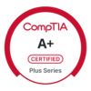
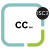
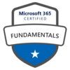

# A.K. Forde Portfolio
Hi! I’m Amy Forde, a professional in transition with a curiosity and passion for all things tech. After building a 10+ year career in social services, I am pivoting to follow my passion for cybersecurity and technology, and I’m excited to dive in and gain hands-on experience.

I love solving problems, learning new skills, and figuring out how things work behind the scenes—whether it’s securing systems or exploring innovative tech solutions. This portfolio is my way of sharing what I’m learning, the projects I’m passionate about, and my journey into the tech world.

I am based in Calgary, Alberta. I’m always eager to connect with people in the industry, exchange ideas, and take on new challenges.

# Certificates
CompTIA A+\
ISC2 Certifiend in Cybersecurity\
IBM Ethical Hacking with Open Source Tools Professional Certificate\
Google Cybersecurity Professional\
Google Workspace Adminstrator\
Microsoft 365 Fundamentals 

# Education
BA in Psychology and English \
Graduated 2016

BSc in Computing and Information Systems\
Expected graduation 2027

# Project Showcase
Systems Design and Analysis\
[Operating Systems Project](Operating Systems Project/ABOUT.md)
Ethical Hacking\
C++ Code Samples
